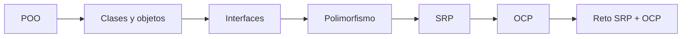
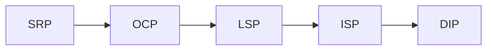

# Riwi SOLID — SRP + OCP

Material didáctico base para estudiar los dos primeros principios SOLID en **Java** mediante teoría breve, ejemplos pequeños y ejercicios de refactorización.

La idea del repositorio es que el coder reciba **código funcional pero mejorable**. Los ejercicios no incluyen soluciones: cada módulo plantea un problema de diseño que debe analizarse y refactorizarse.



## ¿Qué se aprende?

- Qué problema intenta resolver la Programación Orientada a Objetos.
- Qué son una clase, un objeto, un atributo y un método.
- Cómo definir e implementar interfaces en Java.
- Qué significa programar contra un contrato.
- Cómo reconocer múltiples responsabilidades dentro de una clase.
- Cómo aplicar **Single Responsibility Principle (SRP)**.
- Cómo detectar puntos de variación que obligan a modificar código estable.
- Cómo utilizar interfaces y polimorfismo para aplicar **Open/Closed Principle (OCP)**.
- Cómo combinar SRP y OCP en un pequeño sistema.

## Ruta de aprendizaje

Lee los módulos en orden:

| Módulo | Tema |
| --- | --- |
| [01](docs/01-poo.md) | Recordatorio de Programación Orientada a Objetos |
| [02](docs/02-clases-y-objetos.md) | Clases, objetos, estado y comportamiento |
| [03](docs/03-interfaces-y-polimorfismo.md) | Interfaces, contratos y polimorfismo |
| [04](docs/04-srp.md) | Single Responsibility Principle |
| [05](docs/05-ejercicios-srp.md) | Cinco ejercicios de SRP |
| [06](docs/06-ocp.md) | Open/Closed Principle |
| [07](docs/07-ejercicios-ocp.md) | Cinco ejercicios de OCP |
| [08](docs/08-reto-final.md) | Reto final: SRP + OCP |

## Presentación de clase

Abre [la presentación reestructurada](docs/presentacion_SOLID_SRP_OCP_reestructurada.html) en un navegador. Está organizada para acompañar los módulos y ejercicios en este orden:

1. Fundamentos de POO, interfaces y polimorfismo.
2. Diagnóstico, refactorización y ejercicios de SRP.
3. Puntos de extensión y ejercicios de OCP.
4. Reto integrador de OrderService.

## Requisitos

- Java 17 o superior.
- Maven 3.9 o superior.
- Un IDE como IntelliJ IDEA, VS Code o Eclipse.
- Conocimientos básicos de variables, condicionales, métodos y sintaxis Java.

## Preparación

Clona el repositorio y entra en la carpeta:

```bash
git clone https://github.com/WhiteRabbitCoder/Riwi-SOLID-SRP-OCP.git
cd Riwi-SOLID-SRP-OCP
```

Verifica que el proyecto compile:

```bash
mvn clean compile
```

Los ejercicios están diseñados para **compilar desde el inicio**. Tu tarea no es “hacer que funcione”, sino mejorar su diseño aplicando el principio indicado.

## Cómo trabajar los ejercicios

En cada ejercicio:

1. Lee primero el archivo correspondiente en `docs/`.
2. Ejecuta o inspecciona el código inicial.
3. Identifica el problema de diseño.
4. Explica con tus palabras por qué viola o dificulta el principio estudiado.
5. Refactoriza sin cambiar el comportamiento esperado.
6. Comprueba que el proyecto siga compilando.
7. Justifica tus decisiones en comentarios o en tu Pull Request.

> Importante: SOLID no consiste en crear interfaces o clases sin razón. Cada separación debe tener una justificación de diseño.

## Ejercicios disponibles

### SRP

| Ejercicio | Contexto | Objetivo |
| --- | --- | --- |
| SRP 01 | Gestión de usuarios | Identificar responsabilidades |
| SRP 02 | Registro de usuarios | Separar servicio, persistencia y correo |
| SRP 03 | Reportes | Separar análisis, formato, persistencia y envío |
| SRP 04 | Pedidos | Refactorizar un servicio con varias responsabilidades |
| SRP 05 | Rectángulo | Reconocer cuándo **no** dividir |

### OCP

| Ejercicio | Contexto | Objetivo |
| --- | --- | --- |
| OCP 01 | Notificaciones | Eliminar crecimiento por condicionales |
| OCP 02 | Pagos | Diseñar métodos de pago extensibles |
| OCP 03 | Exportadores | Agregar formatos sin modificar el núcleo |
| OCP 04 | Envíos | Encapsular estrategias de cálculo |
| OCP 05 | Ataques de videojuego | Modelar comportamientos intercambiables |

## Estructura

```text
riwi-solid-srp-ocp/
├── docs/
│   ├── 01-poo.md
│   ├── 02-clases-y-objetos.md
│   ├── 03-interfaces-y-polimorfismo.md
│   ├── 04-srp.md
│   ├── 05-ejercicios-srp.md
│   ├── 06-ocp.md
│   ├── 07-ejercicios-ocp.md
│   └── 08-reto-final.md
├── src/main/java/com/riwi/solid/
│   ├── fundamentals/
│   ├── exercises/
│   │   ├── srp/
│   │   └── ocp/
│   └── challenge/
├── .gitignore
├── LICENSE
└── pom.xml
```

## Criterios para revisar una solución

Una buena solución debería poder responder:

- ¿Qué responsabilidad tiene cada clase?
- ¿Qué razón tendría esa clase para cambiar?
- ¿Qué comportamiento puede variar en el futuro?
- ¿Se puede agregar una variante sin modificar código estable?
- ¿La abstracción introducida realmente aporta algo?
- ¿El código quedó más fácil de leer y probar?

## Regla de la clase

No busques “la arquitectura correcta”. Busca una arquitectura que puedas **justificar**.

```text
SRP organiza responsabilidades.
OCP organiza el cambio.
```

## Siguiente evolución

Este repositorio cubre únicamente **S** y **O**. Una continuación natural sería añadir:


